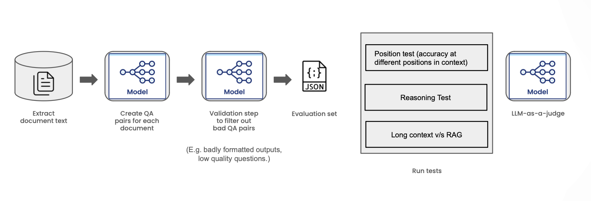

# Beyond the Needle in Haystack Test for Long Context Evaluation

## Overview

This repository provides a Long-Context Eval Framework to evaluate the long context capabilities of large language models (LLMs) on your own data and tasks. This is similar to the "needle in a haystack" (NIAH) test, except the haystack is your own set of documents, and the needles are one or more answer (complete) documents based on which the question is posed.

This is important, as current methods of long context evaluation are either synthetic and unrealistic (such as the NIAH test) or limited to academic datasets (such as [LongBench](https://arxiv.org/abs/2308.14508), [InfiniteBench](https://arxiv.org/abs/2402.13718) and others) which renders them less useful in real world settings. 

The Long-Context Eval Framework overcomes these limitations by (a) creating a realistic test (model must provide a response based on information contained in one or more documents over a long context) and (b) enabling users to evaluate long context capabilities on their own data and tasks. This is done through an automated task generation >> task completion >> task evaluation pipeline, enabled by LLMs. We strongly recommend manually verifying both the inputs (tasks) and outputs (scores). A more detailed description of the methodology is available [here](./docs/METHODOLOGY.md).


<p align="center">
  
</p>


### Supporting tests and tasks

- Effect of position on retrieval accuracy
    - [X] Single Document QA task (a.k.a single needle in a haystack test)
    - [ ] Multi Document QA task
- Effect of context size on long-context versus RAG accuracy
    - [X] Single Document QA task
    - [ ] Multi Document QA task
- Hallucination Index: Extent to which the model hallucinates when the document is not present in context
    - [ ] Single Document QA task


## Installation

```zsh
python3 -m venv venv
source venv/bin/activate
```

```zsh
git clone git@github.com:snorkel-ai/long-context-eval.git
cd long-context-eval
pip install -r requirements.txt
```

See instructions on data and task formats [here](./docs/DATA.md)


We use LangChain for running models. Check LangChain's documentation in order to set up the appropriate API keys and environment variables to access/run models. Currently the following model providers are implemented: `OpenAI`, `Anthropic`, `TogetherAI` and `VertexAI`. See `models.py` for the list of models currently supported. A new model provider and/or model can be easily added in `models.py`.

```zsh
export OPENAI_API_KEY=<YOUR_OPENAI_KEY>
```

```zsh
python long_context_eval/run_benchmark.py --model_name gpt-3.5-turbo \
                                          --data_path ./data/cosmowikidataset \
                                          --task_path ./tasks/data_cosmowiki.json \
                                          --experiment_tag QAtest \
                                          --seed 42

```

For a full list of arguments, run
```zsh
python long_context_eval/run_benchmark.py --help
```

## Experiments and Results
TBD