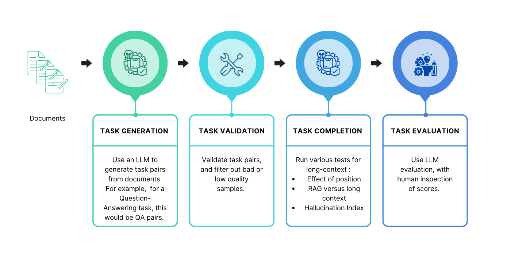

## Methodology

<p align="center">
  
</p>

### 1. Task Generation
To automate benchmarking long context capabilities on your own dataset, we automate the creation of the task using a large language model. We create a question-answering task that automatically creates QA pairs on user documents using a large language model.

```zsh
Ask a factoid question given only the context provided, that can be answered in a few words. Answer the question given the context.
Format your result in a JSON object with keys 'question' and 'answer'.
Context: {context}
Result:
```

You can create your own prompt templates in `prompts_and_formats.py`.

### 2. Validation
Using language models to replace human intensive tasks such as dataset/benchmark creation and evaluation has become commonplace as strong models continue to be released. They are however, not without errors. Without a validation step allows these inaccuracies to filter into the pipeline, leading to compounding errors and ultimately influencing reported results.

While prompting and adding guardrails help to some extent, we find that the validation step cannot be circumvented, and a human-in-the-loop approach is best at ensuring good data at the input and output.

### 3. Task Completion
Presently, the benchmark supports single document QA retrieval, and tests specifically for a) the effect of position on retrieval accuracy, b) the effect of context length (the level of noise) on retrieval performance and a comparison with RAG

#### 3a. Effect of position
Liu et al. showed that models are better at retrieving information from the top or bottom of a long context, while performance greatly reduces when it is contained in the middle. They refer to this phenomenon as the “lost-in-the-middle” effect. In a similar vein, the popular “needle-in-a-haystack” test measures how position affects model performance by injecting a synthetic needle in a document set (they use Paul Graham’s essays).

We conduct a similar test to measure how positioning the document within the context window affects retrieving the answer from it. This is the same as the “needle-in-a-haystack” test except over user documents and realistic needles, rather than the synthetic test. This also effectively tests the “lost-in-the-middle” effect, although the experiment setup is slightly different. (Liu et al. test on a constant number of 10, 20 and 30 distractor documents, that may not reach the full context window of the model, as well as present the distractor documents in order of decreasing relevance, while in our benchmark the distractor documents are shuffled at random).
To measure the effect of position on retrieval performance, we follow the approach below:

```zsh
1. Get M <= N documents that fill up the context window of the model. This is to ensure we can test on the same number of positions for each QA pair.
2. Get QA pairs for the M docs.
3. For each QA pair
   Get M-1 distractor docs that fill up the context along with the answer doc
   For each position K=1,2,...M
        Build context with answer document at position K
        Shuffle and add distractor docs to context
        Generate response
```

#### 3b. Effect of context size on long context and RAG performance
This test mimics a (real world) information retrieval application where the goal is to retrieve the correct document from a large document store. Starting with the answer document in context, we keep adding a random set of distractor (noisy) documents and generate model responses. We test RAG by creating the vector store with the same document set and perform the usual retrieve-generate pipeline. The final iteration contains the entire set of documents in context (or vector store, in case of RAG). 

```zsh
To measure the effect of context length on retrieval performance vis-a-vis RAG, we follow the approach below:
1. Get M <= N documents that fill up the context window of the model. This is needed to know the max number of noisy/distractor documents to add.
2. Starting with context = {test document}
3. Iterate for distractor docs T = 0, 1, 2….M
   For each noise level,
       Create randomly ordered set of distractor docs D
       Add noisy docs to context and complete the task
       Process a RAG pipeline of retrieve, then generate over D
```

### 4. Evaluating responses
We use LLM-as-a-judge to evaluate the responses. On the Single Document QA task, we use the following prompt.

```zsh
For the question provided, return a JSON object with a `correct` key as a boolean, if the given answer and gold standard answer are the same in meaning (may be worded differently).
Question: {question}
Answer: {answer}
Gold standard answer: {gold_answer}
JSON:
```

As with the task generation step, evaluation with a language model is not error proof. While the task is a relatively simple one (check if both answers are correct in semantics), there are cases where we find the LLM judge gives the wrong score. In some cases, the responses contain additional detail, which requires validating the additional piece of information from the document. Furthermore, we find that LLM judge responses can be inconsistent, even with greedy decoding, giving different scores on the same (or very similar) responses.


**Additional Notes**

1. If no task json is provided for the QA task at `task_path`, QA pairs are first generated for each document at `data_path`. Currently only 1 QA pair is generated per document and QA pairs are saved in `./data.json`.
2. We use `tiktoken` to count tokens, so this is approximate for models that do not use the same tokenization.
3. For each document depth, the document containing the answer is positioned at the desired depth in the context, and an LLM response is generated. Currently we test at 0, 25, 50, 75, and 100% depths.
4. For the long context versus RAG test, starting with just the test document, the size of the context window is increased by adding distractor documents. For RAG, a simple Langchain pipeline using Chroma DB (with default parameters) is used to retrieve documents and used as context to generate the response. Currently we test at 0, 25, 50, 75 and 100% of context size.

